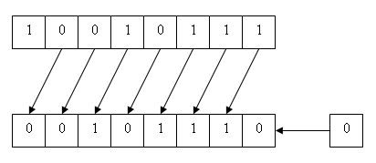
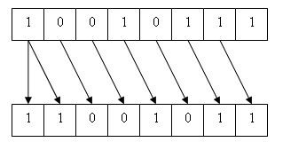
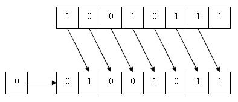

# INT34-C: Bit shift should not be done by a negative operand or an operand of greater-or-equal precision than that of another

This query implements the CERT-C rule INT34-C:

> Do not shift an expression by a negative number of bits or by greater than or equal to the number of bits that exist in the operand


## Description

Bitwise shifts include left-shift operations of the form *shift-expression* `<<` *additive-expression* and right-shift operations of the form *shift-expression* `>>` *additive-expression*. The standard integer promotions are first performed on the operands, each of which has an integer type. The type of the result is that of the promoted left operand. If the value of the right operand is negative or is greater than or equal to the width of the promoted left operand, the behavior is [undefined](https://wiki.sei.cmu.edu/confluence/display/c/BB.+Definitions#BB.Definitions-undefinedbehavior). (See [undefined behavior 51](https://wiki.sei.cmu.edu/confluence/display/c/CC.+Undefined+Behavior#CC.UndefinedBehavior-ub_51).)

Do not shift an expression by a negative number of bits or by a number greater than or equal to the *precision* of the promoted left operand. The precision of an integer type is the number of bits it uses to represent values, excluding any sign and padding bits. For unsigned integer types, the width and the precision are the same; whereas for signed integer types, the width is one greater than the precision. This rule uses precision instead of width because, in almost every case, an attempt to shift by a number of bits greater than or equal to the precision of the operand indicates a bug (logic error). A logic error is different from overflow, in which there is simply a representational deficiency. In general, shifts should be performed only on unsigned operands. (See [INT13-C. Use bitwise operators only on unsigned operands](https://wiki.sei.cmu.edu/confluence/display/c/INT13-C.+Use+bitwise+operators+only+on+unsigned+operands).)

## Noncompliant Code Example (Left Shift, Unsigned Type)

The result of `E1 << E2` is `E1` left-shifted `E2` bit positions; vacated bits are filled with zeros. The following diagram illustrates the left-shift operation.



According to the C Standard, if `E1` has an unsigned type, the value of the result is `E1` \* `2``<sup>E2</sup>`, reduced modulo 1 more than the maximum value representable in the result type.

This noncompliant code example fails to ensure that the right operand is less than the precision of the promoted left operand:

```cpp
void func(unsigned int ui_a, unsigned int ui_b) {
  unsigned int uresult = ui_a << ui_b;
  /* ... */
}
```

## Compliant Solution (Left Shift, Unsigned Type)

This compliant solution eliminates the possibility of shifting by greater than or equal to the number of bits that exist in the precision of the left operand:

```cpp
#include <limits.h>
#include <stddef.h>
#include <inttypes.h>

extern size_t popcount(uintmax_t);
#define PRECISION(x) popcount(x)
 
void func(unsigned int ui_a, unsigned int ui_b) {
  unsigned int uresult = 0;
  if (ui_b >= PRECISION(UINT_MAX)) {
    /* Handle error */
  } else {
    uresult = ui_a << ui_b;
  }
  /* ... */
}
```
The `PRECISION()` macro and `popcount()` function provide the correct precision for any integer type. (See [INT35-C. Use correct integer precisions](https://wiki.sei.cmu.edu/confluence/display/c/INT35-C.+Use+correct+integer+precisions).)

Modulo behavior resulting from left-shifting an unsigned integer type is permitted by exception INT30-EX3 to [INT30-C. Ensure that unsigned integer operations do not wrap](https://wiki.sei.cmu.edu/confluence/display/c/INT30-C.+Ensure+that+unsigned+integer+operations+do+not+wrap).

## Noncompliant Code Example (Left Shift, Signed Type)

The result of `E1 << E2` is `E1` left-shifted `E2` bit positions; vacated bits are filled with zeros. If `E1` has a signed type and nonnegative value, and `E1` \* `2``<sup>E2</sup>` is representable in the result type, then that is the resulting value; otherwise, the behavior is undefined.

This noncompliant code example fails to ensure that left and right operands have nonnegative values and that the right operand is less than the precision of the promoted left operand. This example does check for signed integer overflow in compliance with [INT32-C. Ensure that operations on signed integers do not result in overflow](https://wiki.sei.cmu.edu/confluence/display/c/INT32-C.+Ensure+that+operations+on+signed+integers+do+not+result+in+overflow).

```cpp
#include <limits.h>
#include <stddef.h>
#include <inttypes.h>

void func(signed long si_a, signed long si_b) {
  signed long result;
  if (si_a > (LONG_MAX >> si_b)) {
    /* Handle error */
  } else {
    result = si_a << si_b;
  }
  /* ... */
}
```
Shift operators and other bitwise operators should be used only with unsigned integer operands in accordance with [INT13-C. Use bitwise operators only on unsigned operands](https://wiki.sei.cmu.edu/confluence/display/c/INT13-C.+Use+bitwise+operators+only+on+unsigned+operands).

## Compliant Solution (Left Shift, Signed Type)

In addition to the check for overflow, this compliant solution ensures that both the left and right operands have nonnegative values and that the right operand is less than the precision of the promoted left operand:

```cpp
#include <limits.h>
#include <stddef.h>
#include <inttypes.h>
 
extern size_t popcount(uintmax_t);
#define PRECISION(x) popcount(x)
 
void func(signed long si_a, signed long si_b) {
  signed long result;
  if ((si_a < 0) || (si_b < 0) ||
      (si_b >= PRECISION(ULONG_MAX)) ||
      (si_a > (LONG_MAX >> si_b))) {
    /* Handle error */
  } else {
    result = si_a << si_b;
  }
  /* ... */
}

```
Noncompliant Code Example (Right Shift)

The result of `E1 >> E2` is `E1` right-shifted `E2` bit positions. If `E1` has an unsigned type or if `E1` has a signed type and a nonnegative value, the value of the result is the integral part of the quotient of `E1` / `2``<sup>E2</sup>`. If `E1` has a signed type and a negative value, the resulting value is [implementation-defined](https://wiki.sei.cmu.edu/confluence/display/c/BB.+Definitions#BB.Definitions-implementation-definedbehavior) and can be either an arithmetic (signed) shift



or a logical (unsigned) shift



This noncompliant code example fails to test whether the right operand is greater than or equal to the precision of the promoted left operand, allowing undefined behavior:

```cpp
void func(unsigned int ui_a, unsigned int ui_b) {
  unsigned int uresult = ui_a >> ui_b;
  /* ... */
}
```
When working with signed operands, making assumptions about whether a right shift is implemented as an arithmetic (signed) shift or a logical (unsigned) shift can also lead to [vulnerabilities](https://wiki.sei.cmu.edu/confluence/display/c/BB.+Definitions#BB.Definitions-vulnerability). (See [INT13-C. Use bitwise operators only on unsigned operands](https://wiki.sei.cmu.edu/confluence/display/c/INT13-C.+Use+bitwise+operators+only+on+unsigned+operands).)

## Compliant Solution (Right Shift)

This compliant solution eliminates the possibility of shifting by greater than or equal to the number of bits that exist in the precision of the left operand:

```cpp
#include <limits.h>
#include <stddef.h>
#include <inttypes.h>

extern size_t popcount(uintmax_t);
#define PRECISION(x) popcount(x)
 
void func(unsigned int ui_a, unsigned int ui_b) {
  unsigned int uresult = 0;
  if (ui_b >= PRECISION(UINT_MAX)) {
    /* Handle error */
  } else {
    uresult = ui_a >> ui_b;
  }
  /* ... */
}
```
**Implementation Details**

GCC has no options to handle shifts by negative amounts or by amounts outside the width of the type predictably or to trap on them; they are always treated as undefined. Processors may reduce the shift amount modulo the width of the type. For example, 32-bit right shifts are implemented using the following instruction on x86-32:

```cpp
sarl   %cl, %eax

```
The `sarl` instruction takes a bit mask of the least significant 5 bits from `%cl` to produce a value in the range \[0, 31\] and then shift `%eax` that many bits:

```cpp
// 64-bit right shifts on IA-32 platforms become
shrdl  %edx, %eax
sarl   %cl, %edx

```
where `%eax` stores the least significant bits in the doubleword to be shifted, and `%edx` stores the most significant bits.

## Risk Assessment

Although shifting a negative number of bits or shifting a number of bits greater than or equal to the width of the promoted left operand is undefined behavior in C, the risk is generally low because processors frequently reduce the shift amount modulo the width of the type.

<table> <tbody> <tr> <th> Rule </th> <th> Severity </th> <th> Likelihood </th> <th> Remediation Cost </th> <th> Priority </th> <th> Level </th> </tr> <tr> <td> INT34-C </td> <td> Low </td> <td> Unlikely </td> <td> Medium </td> <td> <strong>P2</strong> </td> <td> <strong>L3</strong> </td> </tr> </tbody> </table>


## Automated Detection

<table> <tbody> <tr> <th> Tool </th> <th> Version </th> <th> Checker </th> <th> Description </th> </tr> <tr> <td> <a> Astrée </a> </td> <td> 22.04 </td> <td> <strong>precision-shift-width</strong> <strong>precision-shift-width-constant</strong> </td> <td> Fully checked </td> </tr> <tr> <td> <a> Axivion Bauhaus Suite </a> </td> <td> 7.2.0 </td> <td> <strong>CertC-INT34</strong> </td> <td> Can detect shifts by a negative or an excessive number of bits and right shifts on negative values. </td> </tr> <tr> <td> <a> CodeSonar </a> </td> <td> 7.2p0 </td> <td> <strong>LANG.ARITH.BIGSHIFT</strong> <strong>LANG.ARITH.NEGSHIFT</strong> </td> <td> Shift amount exceeds bit width Negative shift amount </td> </tr> <tr> <td> <a> Compass/ROSE </a> </td> <td> </td> <td> </td> <td> Can detect violations of this rule. Unsigned operands are detected when checking for <a> INT13-C. Use bitwise operators only on unsigned operands </a> </td> </tr> <tr> <td> <a> Coverity </a> </td> <td> 2017.07 </td> <td> <strong>BAD_SHIFT</strong> </td> <td> Implemented </td> </tr> <tr> <td> <a> Cppcheck </a> </td> <td> 1.66 </td> <td> <strong>shiftNegative, shiftTooManyBits</strong> </td> <td> Context sensitive analysis Warns whenever Cppcheck sees a negative shift for a POD expression (The warning for shifting too many bits is written only if Cppcheck has sufficient type information and you use <code>--platform</code> to specify the sizes of the standard types.) </td> </tr> <tr> <td> <a> ECLAIR </a> </td> <td> 1.2 </td> <td> <strong>CC2.INT34</strong> </td> <td> Partially implemented </td> </tr> <tr> <td> <a> Helix QAC </a> </td> <td> 2022.4 </td> <td> <strong>C0499, C2790, </strong> <strong>C++2790, C++3003</strong> <strong>DF2791, DF2792, DF2793</strong> </td> <td> </td> </tr> <tr> <td> <a> Klocwork </a> </td> <td> 2022.4 </td> <td> <strong>MISRA.SHIFT.RANGE.2012</strong> </td> <td> </td> </tr> <tr> <td> <a> LDRA tool suite </a> </td> <td> 9.7.1 </td> <td> <strong>51 S, 403 S, 479 S</strong> </td> <td> Partially implemented </td> </tr> <tr> <td> <a> Parasoft C/C++test </a> </td> <td> 2022.2 </td> <td> <strong>CERT_C-INT34-a</strong> </td> <td> Avoid incorrect shift operations </td> </tr> <tr> <td> <a> Polyspace Bug Finder </a> </td> <td> R2022b </td> <td> <a> CERT C: Rule INT34-C </a> </td> <td> Checks for: Shift of a negative valuehift of a negative value, shift operation overflowhift operation overflow. Rule partially covered. </td> </tr> <tr> <td> <a> PRQA QA-C </a> </td> <td> 9.7 </td> <td> <strong>0499, 2790 \[C\], 2791 \[D\], 2792 \[A\], 2793 \[S\]</strong> </td> <td> Partially implemented </td> </tr> <tr> <td> <a> PRQA QA-C++ </a> </td> <td> 4.4 </td> <td> <strong>2791, 2792, 2793, 3003, 3321, 3322</strong> </td> <td> </td> </tr> <tr> <td> <a> PVS-Studio </a> </td> <td> 7.23 </td> <td> <a> V610 </a> </td> <td> </td> </tr> <tr> <td> <a> RuleChecker </a> </td> <td> 22.04 </td> <td> <strong>precision-shift-width-constant</strong> </td> <td> Partially checked </td> </tr> <tr> <td> <a> TrustInSoft Analyzer </a> </td> <td> 1.38 </td> <td> <strong>shift</strong> </td> <td> Exhaustively verified (see <a> one compliant and one non-compliant example </a> ). </td> </tr> </tbody> </table>


## Related Vulnerabilities

Search for [vulnerabilities](https://wiki.sei.cmu.edu/confluence/display/c/BB.+Definitions#BB.Definitions-vulnerability) resulting from the violation of this rule on the [CERT website](https://www.kb.cert.org/vulnotes/bymetric?searchview&query=FIELD+KEYWORDS+contains+INT34-C).

## Related Guidelines

[Key here](https://wiki.sei.cmu.edu/confluence/display/c/How+this+Coding+Standard+is+Organized#HowthisCodingStandardisOrganized-RelatedGuidelines) (explains table format and definitions)

<table> <tbody> <tr> <th> Taxonomy </th> <th> Taxonomy item </th> <th> Relationship </th> </tr> <tr> <td> <a> CERT C </a> </td> <td> <a> INT13-C. Use bitwise operators only on unsigned operands </a> </td> <td> Prior to 2018-01-12: CERT: Unspecified Relationship </td> </tr> <tr> <td> <a> CERT C </a> </td> <td> <a> INT35-C. Use correct integer precisions </a> </td> <td> Prior to 2018-01-12: CERT: Unspecified Relationship </td> </tr> <tr> <td> <a> CERT C </a> </td> <td> <a> INT32-C. Ensure that operations on signed integers do not result in overflow </a> </td> <td> Prior to 2018-01-12: CERT: Unspecified Relationship </td> </tr> <tr> <td> <a> ISO/IEC TR 24772:2013 </a> </td> <td> Arithmetic Wrap-Around Error \[FIF\] </td> <td> Prior to 2018-01-12: CERT: Unspecified Relationship </td> </tr> <tr> <td> <a> CWE 2.11 </a> </td> <td> <a> CWE-682 </a> </td> <td> 2017-07-07: CERT: Rule subset of CWE </td> </tr> <tr> <td> <a> CWE 2.11 </a> </td> <td> <a> CWE-758 </a> </td> <td> 2017-07-07: CERT: Rule subset of CWE </td> </tr> </tbody> </table>


## CERT-CWE Mapping Notes

[Key here](https://wiki.sei.cmu.edu/confluence/pages/viewpage.action?pageId=87152408#HowthisCodingStandardisOrganized-CERT-CWEMappingNotes) for mapping notes

**CWE-758 and INT34-C**

Independent( INT34-C, INT36-C, MEM30-C, MSC37-C, FLP32-C, EXP33-C, EXP30-C, ERR34-C, ARR32-C)

CWE-758 = Union( INT34-C, list) where list =

* Undefined behavior that results from anything other than incorrect bit shifting
**CWE-682 and INT34-C**

Independent( INT34-C, FLP32-C, INT33-C) CWE-682 = Union( INT34-C, list) where list =

* Incorrect calculations that do not involve out-of-range bit shifts

## Bibliography

<table> <tbody> <tr> <td> \[ <a> C99 Rationale 2003 </a> \] </td> <td> 6.5.7, "Bitwise Shift Operators" </td> </tr> <tr> <td> \[ <a> Dowd 2006 </a> \] </td> <td> Chapter 6, "C Language Issues" </td> </tr> <tr> <td> \[ <a> Seacord 2013b </a> \] </td> <td> Chapter 5, "Integer Security" </td> </tr> <tr> <td> \[ <a> Viega 2005 </a> \] </td> <td> Section 5.2.7, "Integer Overflow" </td> </tr> </tbody> </table>


## Implementation notes

None

## References

* CERT-C: [INT34-C: Do not shift an expression by a negative number of bits or by greater than or equal to the number of bits that exist in the operand](https://wiki.sei.cmu.edu/confluence/display/c)
