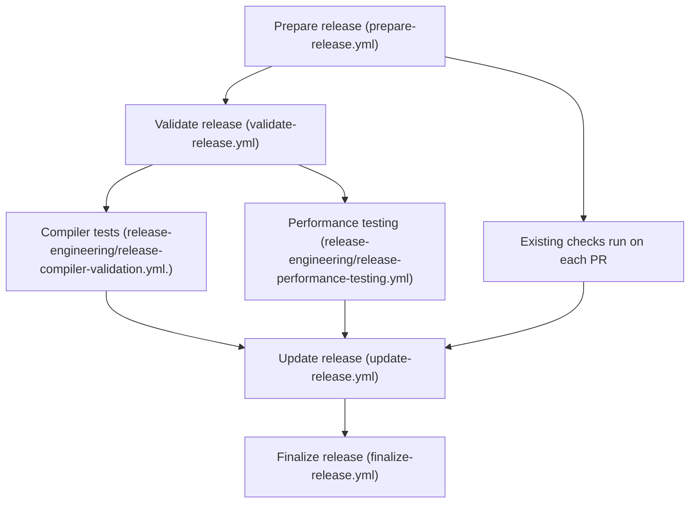

# Coding Standards: Developer handbook

## Document management

**Document ID:** codeql-coding-standards/developer-handbook

| Version | Date       | Author           | Changes                                                                                                                                                                                                                                                                                   |
| ------- | ---------- | ---------------- | ----------------------------------------------------------------------------------------------------------------------------------------------------------------------------------------------------------------------------------------------------------------------------------------- |
| 0.1.0   | 2021-02-02 | Luke Cartey      | Initial version.                                                                                                                                                                                                                                                                          |
| 0.2.0   | 2021-02-19 | Luke Cartey      | Add section on Python environment preparation.                                                                                                                                                                                                                                            |
| 0.3.0   | 2021-04-13 | Michael Hohn     | Add cookbook section documenting common procedures.                                                                                                                                                                                                                                       |
| 0.4.0   | 2021-04-13 | Mario Campos     | Add submodule out of date tip to the cookbook section.                                                                                                                                                                                                                                    |
| 0.5.0   | 2021-04-30 | Luke Cartey      | Add query style guide.                                                                                                                                                                                                                                                                    |
| 0.6.0   | 2021-05-05 | John Singleton   | Add task automation files.                                                                                                                                                                                                                                                                |
| 0.7.0   | 2021-05-10 | Luke Cartey      | Explain non-constant alert messages.                                                                                                                                                                                                                                                      |
| 0.8.0   | 2021-05-27 | Luke Cartey      | Clarify the `short_name` property.                                                                                                                                                                                                                                                        |
| 0.9.0   | 2021-09-06 | Luke Cartey      | <ul><li>Update code review requirements.</li><li>Update release process documentation.</li></ul>                                                                                                                                                                                          |
| 0.10.0  | 2021-09-08 | Luke Cartey      | Update tool qualification section.                                                                                                                                                                                                                                                        |
| 0.11.0  | 2021-09-10 | Luke Cartey      | Add reporting and deviations to scope of work.                                                                                                                                                                                                                                            |
| 0.12.0  | 2021-09-18 | Luke Cartey      | <ul><li>Document conditions for overriding PR checks.</li><li>Clarify that LGTM and GHAS are out of scope.</li><li>Document our used versioning control system.</li></ul>                                                                                                                 |
| 0.13.0  | 2021-09-22 | Remco Vermeulen  | Document rule package schema.                                                                                                                                                                                                                                                             |
| 0.14.0  | 2021-10-11 | Luke Cartey      | Document how to update dependencies.                                                                                                                                                                                                                                                      |
| 0.15.0  | 2021-10-26 | John Singleton   | Document false positive triage process.                                                                                                                                                                                                                                                   |
| 0.16.0  | 2021-11-29 | Remco Vermeulen  | Add document management section.                                                                                                                                                                                                                                                          |
| 0.17.0  | 2021-11-29 | Remco Vermeulen  | <ul><li>Explain the process of determining if a guideline is amenable to automated static analysis.</li><li>Document the supported language.</li><li>Document the `short_name` property update process.</li><li>Describe guidelines for splitting a rule into multiple queries.</li></ul> |
| 0.18.0  | 2022-02-16 | Remco Vermeulen  | Address mistake in point 2 in section *Splitting a rule into multiple queries*.                                                                                                                                                                                                           |
| 0.19.0  | 2022-06-15 | Remco Vermeulen  | Replace references and steps related to Markdown help files.                                                                                                                                                                                                                              |
| 0.20.0  | 2022-07-05 | Remco Vermeulen  | Expand scope of work to include CERT-C and MISRA C.                                                                                                                                                                                                                                       |
| 0.21.0  | 2022-07-05 | Remco Vermeulen  | Update architecture section to include the supported languages C90, C99, and C11.                                                                                                                                                                                                         |
| 0.22.0  | 2022-07-05 | Remco Vermeulen  | Update section `Generation of query templates from rule specifications` to include external help files.                                                                                                                                                                                   |
| 0.23.0  | 2022-07-05 | Remco Vermeulen  | Update text to consider both the C++ and the C standards.                                                                                                                                                                                                                                 |
| 0.24.0  | 2022-07-05 | Remco Vermeulen  | Update release process to include steps for external help files.                                                                                                                                                                                                                          |
| 0.25.0  | 2022-07-14 | David Bartolomeo | Add section on installing QL dependencies and update CLI commands to account for the migration to CodeQL packs.                                                                                                                                                                           |
| 0.25.0  | 2022-07-22 | Jeroen Ketema    | Document the existence and purpose of the `next` branch.                                                                                                                                                                                                                                  |
| 0.26.0  | 2022-08-10 | Remco Vermeulen  | Address incorrect package file generation command. This was missing the required language argument.                                                                                                                                                                                       |
| 0.27.0  | 2022-11-08 | Luke Cartey | Update the versions of C we intend to support to exclude C90, which reflects the intended scope at the outset of the project.                                                                                                                                                                                       |
| 0.28.0  | 2023-08-14 | Luke Cartey | Remove references to LGTM which is now a legacy product.  |
| 0.29.0 | 2023-10-11 | Remco Vermeulen | Update release process. |
| 0.29.1 | 2023-10-11 | Remco Vermeulen | Address Markdown linter problems. |
| 0.30.0 | 2023-11-14 | Remco Vermeulen | Clarify release steps in case of a hotfix release. |
| 0.31.0 | 2024-02-23 | Remco Vermeulen | Clarify the required use of Python version 3.9 |
| 0.32.0 | 2024-05-01 | Luke Cartey | Refer to the user manual for the list of supported standards. |
| 0.33.0 | 2024-07-30 | Kristen Newbury | Remove out dated references to codeql modules directory usage. |
| 0.34.0 | 2024-08-22 | Kristen Newbury | Remove out dated references to git submodules usage. |
| 0.35.0 | 2025-01-15 | Mike Fairhurst | Add guidance for the addition of 'strict' queries. |

## Scope of work

A *coding standard* is a set of rules or guidelines which restrict or prohibit the use of certain dangerous or confusing coding patterns or language features. This repository contains CodeQL queries (and supporting processes) which implement a number of different coding standards. The currently supported standards are documented in the [user manual](user_manual.md).

Each coding standard consists of a list of "guidelines", however not all the guidelines in all the standards will be amenable to automated static analysis. The AUTOSAR C++ standard categorizes the guidelines according to enforcement by static analysis tools in section *5.1.3 Rule classification according to enforcement by static analysis* of the standard. The CERT-C++ standard does not provide such categorization, but frequently has a [documented](https://wiki.sei.cmu.edu/confluence/display/cplusplus/How+this+Coding+Standard+Is+Organized#HowthisCodingStandardIsOrganized-AutomatedDetection) automated detection section for guidelines that documents tools, including their limitations, that can verify the guidelines in question. We have therefore carefully reviewed each supported standard. For each guidelines that is not categorized as automatic enforceable we have determined,in conjunction with end users, what parts of the guideline can be supported in which capacity with CodeQL.

For some of the rules which are not amenable to static analysis, we may opt to provide a query which aids with "auditing" the rules. For example, AUTOSAR includes a rule (A10-0-1) "Public inheritance shall be used to implement 'is-a' relationship.". This is not directly amenable to static analysis, because it requires external context around the concept being modeled. However, we can provide an "audit" rule which reports all the public and private inheritance relationships in the program, so they can be manually verified.

For other rules, there may be means of indicating that a contravention is intentional, and where requiring a _devation report_ may be extra burdensome on developers and require double-entry. These results should be reported under a "strict" query. For instance, `RULE-2-8` "A project should not contain unused object definitions," where adding `__attribute__((unused))` may be preferable in order to suppress compiler warnings (which _deviation reports_ do not do) and are highly indicative of an intentional contravention by a developer.

For each rule which will be implemented with a query we have assigned a "rule package". Rule packages represent sets of rules, possibly across standards, that will be implemented together. Examples of rule packages include "Exceptions", "Naming", "Pointers" and so forth. By implementing queries for related rules together, we intend to maximize the amount of code shared between queries, and to ensure query developers can gain a deep understanding of that specific topic.

The canonical list of rules, with implementation categorization and assigned rule packages, are stored in this repository in the `rules.csv` file.

### Software tool qualification under ISO 26262

A common use case for the coding standards specified above is to to help in the certification process for safety critical or low fault tolerance systems. For these purposes the "CodeQL Coding Standards" pack is intended to be qualified as a "software tool" under "Part 8: Supporting processes" of ISO 26262 ("Road vehicles - Functional Safety"). For more details, see [iso_26262_tool_qualification.md](iso_26262_tool_qualification.md).

To support the functional safety use case, the scope of work for this project also includes:

- *Analysis reporting* - producing reports for functional safety purposes that summarize the findings and highlight any issues during analysis that could compromise the integrity of those findings.
- *Deviations* - a process for suppressing valid results, and maintaining metadata

The requirements for these additional components are taken from the [MISRA Compliance 2020](https://www.misra.org.uk/app/uploads/2021/06/MISRA-Compliance-2020.pdf) document. Further details of these use cases can be found in the [user manual](user_manual.md).

## Rule development process

### Overview

- For each selected rule we will write one or more CodeQL queries that implement the rule (see section *Splitting a rule into multiple queries*).
- Queries will be grouped into CodeQL packs, according to the coding standard the rule comes from.
- To ensure consistency and increase the speed of development, we generate outline query files from the `rules.csv` specification file.
- Where a rule is duplicated across different standards, we will still create separate queries for each standard, but the implementation may be shared between the standards. This allows each version to provide different metadata, and to be enabled/disabled individually.

### Architecture

For each supported coding standard we will provide:

 1. A CodeQL query pack containing the queries that implement the designated rules.
 2. A CodeQL query pack containing the unit tests ("qltests") for each of the queries.

These packs will be organized by supported language.
The current supported languages are:

- C++14 standardized by [ISO/IEC 14882:2014](https://www.iso.org/standard/64029.html) located in the directory `cpp`.
- [C99] standardized by [ISO/IEC 9899:1999](https://www.iso.org/standard/29237.html) and C11 standardized by [ISO/IEC 9899:2011](https://www.iso.org/standard/57853.html). All are located in the directory `c`.

For each language, we will also include:

 1. A CodeQL query pack containing "common" libraries, which provide support.
 2. A CodeQL query pack containing tests for the "common" libraries.

The standards packs will depend on the "common" pack for the given language. This will allow the different standards to share implementation libraries.

In the repository, this will be organized as follows:

```text
<lang>/
  <standard>/
    src/
      rules/
        <rule_id>/
          <rule-short-name>.ql
          <rule-short-name>.md
      codeql-suites/
        <standard>-default.qls
        ...
      qlpack.yml
    test/
      rules/
        <rule_id>/
          test.cpp
          ...
          <rule-short-name>.expected
          <rule-short-name>.qlref
      qlpack.yml
  common/
    src/
      codingstandards/
        cpp/
          ...
      qlpack.yml
    test/
      ...
      qlpack.yml
```

### Splitting a rule into multiple queries

A coding standard rule can be implemented by multiple CodeQL queries.
The decision to split a rule into multiple queries should be driven by the following guidelines:

1. A split of a rule in a query simplifies the implementation of each individual query. Indicators are:
   - The number of cases with CodeQL classes that cannot be further generalized because they don't have a common ancestor CodeQL class or have conceptually different representations such as local and global declarations.
   - Multiple language constructs that must be considered such as template vs non-template classes/functions.
2. A corner case of a rule that is responsible for a significant number of alerts in projects not build with that case in mind. A separate query enables a sub-rule deviation.
   - An example is the AUTOSAR guideline `A2-3-1` that prohibits the use of characters outside the basic source character set defined in `[lex.charset]`. Having a separate rule for comments enables a deviation on violations in just comments and keeps violations detected in string literals or identifiers.

### Generation of query templates from rule specifications

In order to speed up rule development and ensure implementation consistency we have created a series of scripts that generate templated rule files based on the `rules.csv` rule specification file. This generation process works on a per-rule package basis, and is driven by the creation of a "rule package description file", describing the mapping from rules to queries which will implement those rules.

For this, there is a three step process:

1. Generate a rule package description file for a given rule package.
2. Review each entry in the rule package description file, updating the names and properties of the queries that will be written to implement these rules.
3. Generate rule files from the rule package description file for a given rule package.

After these scripts have been run each query specified in the rule package description file will have:

- query files,
- query help files,
- empty query test files, and
- query test reference files generated in per-rule directories within each coding standard.

These files will be ready for query implementation.

#### Step 0: Prepare the Python environment

The tooling standardizes on Python 3.9 and requires the use of version 3.9 to run all tooling.
The `scripts` directory contains the pip package specification file `requirements.txt` that contains the dependencies our generation scripts rely upon.

The dependencies can be installed as follows:

```bash
pip3.9 install -r scripts/requirements.txt
```

It is advisable to use a Python 3.9 virtual environment which needs to be created and activated before installing the dependencies. This can be done as follows:

```bash
python3.9 -mvenv scripts/.venv
. scripts/.venv/bin/activate
pip3.9 install -r scripts/requirements.txt
```

#### Step 1: Generate rule package description file

To generate the rule package description file, run the following script from the root of the repository:

```bash
python3.9 scripts/generate_rules/generate_package_description.py <target_lang_name> <rule_package_name>
```

This will produce a `.json` file in the `rule_packages` directory with the name of the rule package (e.g. `rule_packages/Literals.json`). For example, `python3.9 scripts/generate_rules/generate_package_description.py c Types` creates `rule_packages/c/Types.json`.

#### Step 2: Review and update the rule package description file

The rule package description file produced in previous step is a `json` file which has the following structure:

- A rule package object, with properties for each coding standard.
- A coding standard object, with properties for each implemented rule.
- A rule object, with:
  - A `properties` property specifying some key-value pairs describing properties of the rule.
  - A `title`s property specifying the rule title (also known as the rule "headline").
  - A `queries` property, specifying an array of query objects
- A query object, with:
  - A `description` property, which will be used to populate the `@description` query metadata property value for this query.
  - A `kind` property, which will be used to populate the `@kind` query metadata property value for this query.
  - A `name` property, which will be used to populate the `@name` query metadata property value for this query.
  - A `precision` property, which will be used to populate the `@precision` query metadata property value for this query.
  - A `severity` property, which will be used to populate the `@severity` query metadata property value for this query.
  - A `short_name` property, which will be used in the filenames for each file generated for this query, most notable as the name of the generated `.ql` query file, as well as the query id.
  - A `tags` property, which will be used to populate the `@tags` query metadata property value for this query.

For example, this is the first part of the `Exceptions2.json` package file:

```json
{
  "AUTOSAR": {
    "A15-1-1": {
      "properties": {
        "allocated-target": [
          "implementation"
        ],
        "enforcement": "automated",
        "obligation": "advisory"
      },
      "queries": [
        {
          "description": "Throwing types which are not derived from std::exception can lead to developer confusion.",
          "kind": "problem",
          "name": "Only instances of types derived from std::exception should be thrown",
          "precision": "very-high",
          "severity": "recommendation",
          "short_name": "OnlyThrowStdExceptionDerivedTypes",
          "tags": [
            "maintainability"
          ]
        }
      ],
      "title": "Only instances of types derived from std::exception should be thrown."
    }
```

The `generate_package_description.py` script generates a rule package description file which has a single query per-rule and each query is described by a set of properties.
The properties of a query include the [documented](https://codeql.github.com/docs/writing-codeql-queries/metadata-for-codeql-queries/#metadata-properties) metadata properties of a CodeQL query and a name used, defined by the `short_name` property, to generate the required query files.
The query metadata instructs the CodeQL how to handle the query and display its results. It also provides the users with information about what the query results mean.

The `generate_package_description.py` script provides a "best-effort" approach to setting each of the properties. For that reason, the rule package description file must be reviewed and updated. For each rule:

- Review the rule text in the relevant standard, and determine the number of queries
- For each `query` object review and update the following properties:
  - `description` - ***must not be empty and end with a full stop*** - will be blank, unless the rule headline was too long to fit in the `name` property, in which case it will contain the rule headline. If the `description` is blank, fill it in explaining *why* this could be a problem by explaining the consequences (see the CodeQL [metadata descriptions](https://github.com/github/codeql/blob/main/docs/query-metadata-style-guide.md#query-descriptions-description) documentation for more details).
  - `kind` - pre-populated to `problem`. Modify to `path-problem` if this query is likely to use path explanations - for example, to explain data flow path.
  - `name` - will be pre-populated the first 100 characters of the rule headline text, truncated at a sensible point. This should be a single sentence, and ***must not end in a full stop***.
  - `precision` - pre-populated based on a "difficulty" column present in the `rules.csv`. Set according to the definition specified in the CodeQL [metadata properties](https://codeql.github.com/docs/writing-codeql-queries/metadata-for-codeql-queries/#metadata-properties) documentation.
  - `severity` - will be pre-populated to `error`, but should be adjusted based on the query. The criteria is that if the query does report a true positive
    - `error` - if the reported issue is either directly a security vulnerability, or directly causes a bug or crash in the program.
    - `warning` - if the reported issue is not an error, but could indirectly lead to a security vulnerability or a bug or crash in the program.
    - `recommendation` - if the reported issue is primarily a stylistic or maintainability issue.
  - `short_name` - must be a PascalCase string without spaces, which will be used for the name of the query file and to generate a query id. Pre-populated heuristically from from the rule headline text. Make adjustments as appropriate:
    - The short name must not exceed 50 characters.
    - Consider whether the query can be described more succinctly. For example `OnlyInstancesOfTypesDerivedFromExceptionShouldBeThrown` can be summarized more clearly as `OnlyThrowStdExceptionDerivedTypes`.
  - `tags` - Apply at least one tag from the possible values listed below. If you want to use a query that is not listed a new tag can be added through a PR that modifies the possible tag values in the `query` sub-schema located in `schemas/rule-package.schema.json` and updates the list of possible values described below.
    - `correctness` - if the query identifies incorrect program behavior.
    - `security` - if the query identifies a potential security vulnerability.
    - `readability` - if the query identifies an issue which makes the code harder to read.
    - `maintainability` - if the query identifies an issue which makes the code harder to maintain.
    - `performance` - if the query identifies an issue which has a negative impact on the performance of the code.
    - `concurrency` - if the query identifies a concurrency issue.
  - Validate the rule package description file using the `validate-rule-package.py` script that validates the rule package descriptions against the schema `rule-package.schema.json` located in the `schemas` directory.
    - `python3.9 scripts/validate-rule-package.py <rule_package_name>`

#### Step 3

Ensure that the repository [codeql-coding-standards-help](https://github.com/github/codeql-coding-standards-help) cloned as a sibling of the [codeql-coding-standards](https://github.com/github/codeql-coding-standards) repository switched to a branch that matches the branch your are working on.

To generate the rule package files, run the following script from the root of the repository:

```bash
python3.9 scripts/generate_rules/generate_package_files.py <language> <rule_package_name>
```

If the repository [codeql-coding-standards-help](https://github.com/github/codeql-coding-standards-help) is not cloned as a sibling, then run the script as follows:

```bash
python3.9 scripts/generate_rules/generate_package_files.py  --external-help-dir <codeql_coding_standards_help_path> <language> <rule_package_name>
```

After running this script, the following files will be generated in the `<lang>/<standard>/src/rules/<rule-id>/` directory:

- A `<query.short_name>.ql` query file with the query metadata pre-populated, and the standard imports included.
- A `<query.short_name>.md` query help file with some boilerplate text describing the purpose of the query.

For the standards AUTOSAR and MISRA the help files will generated in the `<lang>/<standard>/src/rules/<rule-id>` directory of the cloned [codeql-coding-standards-help](https://github.com/github/codeql-coding-standards-help) repository if available, otherwise the help file generation is skipped.

In addition, the following files will be generated in the `<lang>/<standard>/test/rules/<rule-id>/` directory:

- An empty `test.cpp` or `test.c` file.
- A `<query.short_name>.qlref` file, which refers to the generated query file.
- A `<query.short_name>.expected` file, which contains some boiler plate text. This ensures that when qltest is run, it will not succeed, but it will allow the "Compare results" option in the CodeQL VS Code extension (which is only usually available with an `.expected` results file).

The script can be safely re-run, except in a few notable cases listed below. Re-running the script has the following effect:

- Overwrites`<query.short_name>.qlref` file.
- Updates the autogenerated sections of the `<query.short_name>.md` file.
- Touches the `test.cpp`, `test.c`, and `<query.short_name>.expected` files, to ensure they exist on disk, but does not modify them if they exist.
- Updates the `<query.short_name>.ql` query by overwriting the query metadata block only. The QL portion of the file is left untouched.

The notable exceptions are:

- If a `query` object is deleted from the rule package description file, it will not be deleted on disk.
- If a `query` object has the `short_name` property modified in the rule package description file, query files will be created under the new name, but the query files for the old name will not be deleted.

### Updating the query from the rule specification

Updates to the rule specification require an update of the generated queries files.
As described in *step 3* of the section *Generation of query templates from rule specifications* the script `scripts/generate_rules/generate_package_files.py` can be safely re-run with the documented exceptions.

Each property of a query in the rule specification can be changed and the generated query files can be updated by rerunning the script `scripts/generate_rules/generate_package_files.py` with exception of the property `query.shortname`. Updating the `query.shortname` property is discussed in the next section.

#### Updating the query shortname

Changing the `query.shortname` property requires a manual update process with the following steps.

1. Determine the query who's `query.shortname` property needs to be updated.
2. Change the `query.shortname` value and generate the query files as described in *step 3* of the section *Generation of query templates from rule specifications*.
3. Migrate the query definition (excluding the query meta-data) from the previous query file to the new query file identified with the updated shortname.
4. Migrate the relevant sections from query help file from the previous query help file to the new help query file identified with the updated shortname.
5. Migrate the test case expected file identified by old `<query.shortname>.expected` to the update `<query.shortname>.expected` name.
6. Validate that the new test case passes by following the procedure described in the section *Running unit tests*.
7. Remove the following files with `git rm <file>` where `query.shortname` reflects the old shortname in the directory `<lang>/<standard>/src/rules/<rule-id>/`:
     - `<query.short_name>.ql`
     - `<query.short_name>.md`

### Query style guide

The following list describes the required style guides for a query that **must** be validated during the code-review process described in section *Code review and automated checks*.

A query **must** include:

- A use of the `isExcluded` predicate on the element reported as the primary location. This predicate ensures that we have a central mechanism for excluding results. This predicate may also be used on other elements relevant to the alert, but only if a suppression on that element should also cause alerts on the current element to be suppressed.
- A well formatted alert message:
  - The message should be a complete standalone sentence, with punctuation and a full stop.
  - The message should refer to this particular instance of the problem, rather than repeating the generic rule. e.g. "Call to banned function x." instead of "Do not use function x."
  - Code elements should be placed in 'single quotes', unless they are formatted as links.
  - Avoid value judgments such as "dubious" and "suspicious", and focus on factual statements about the problem.
  - If possible, avoid constant alert messages. Either add placeholders and links (using $@), or concatenate element names to the alert message. Non-constant messages make it easier to find particular results, and links to other program elements can help provide additional context to help a developer understand the results. Examples:
    - Instead of `Call to banned function.` prefer `Call to banned function foobar.`.
    - Instead of `Return value from call is unused.` prefer `Return value from call to function [x] is unused.`, where `[x]` is a link to the function itself.
  - Do not try to explain the solution in the message; instead that should be provided in the help for the query.

All public predicates, classes, modules and files should be documented with QLDoc. All QLDoc should follow the [QLDoc style guide](https://github.com/github/codeql/blob/main/docs/qldoc-style-guide.md).

### Installing QL dependencies

All of our query and library packs depend on the standard CodeQL library for C++, `codeql/cpp-all`. This dependency is specified in the `qlpack.yml` file for each of our packs. Before compiling, running, or testing any of our queries or libraries, you must download the proper dependencies by running `python3.9 scripts/install-packs.py`. This will download the appropriate version of the standard library from the public package registry, installing it in a cache in your `~/.codeql` directory. When compiling queries or running tests, the QL compiler will pick up the appropriate dependencies from this cache without any need to specify an additional library search path on the command line.

Because the downloaded packs are cached, it is only necessary to run `install-packs.py` once each time we upgrade to a new standard library version. It does not hurt to run it more often; if all necessary packs are already in the download cache, then it will complete quickly without trying to download anything.

### Unit testing

Every query which implements a rule **must** include:

- One or more unit tests.
- One or more unit tests for every non-trivial library.
- For each unit test both "compliant" and "non-compliant" test cases, and should exercise each different logical condition uniquely provided in the query, where possible within the testing framework. The scope of each test should be those conditions specific to this query. In particular, functionality provided by the CodeQL Standard Library for C++ does not need to be tested.

#### Running unit tests

During query development in VS Code, the unit tests can be run using the [testing features](https://codeql.github.com/docs/codeql-for-visual-studio-code/testing-codeql-queries-in-visual-studio-code/) in the CodeQL extension.

Unit tests can also be run on the command line using the CodeQL CLI. With an appropriate CodeQL CLI (as specified in the `supported_codeql_configs.json` at the root of the repository), you can run the following from the root of the repository:

```bash
codeql test run --show-extractor-output path/to/test/directory
```

- `--show-extractor-output` - this shows the output from the extractor. It is most useful when the test fails because the file is not valid C++, where the extractor output will include the compilation failure. This is not shown in VS Code.
- `path/to/test/directory` - this can be a qlref file (like `cpp/autosar/test/rules/A15-2-2/`), a rule directory (`cpp/autosar/test/rules/A15-2-2/`) or a test qlpack (`cpp/autosar/test/`).

For more details on running unit tests with the CodeQL CLI see the [Testing custom queries](https://codeql.github.com/docs/codeql-cli/testing-custom-queries/) help topic.

#### Style guide

The C++ test cases **must** be formatted with `clang_format`.

- Test functions should be called `test_<test_case>`, where `<test_case>` is a brief description of this test case.

If possible, use meaningful names for elements in test cases. Where arbitrary names are required, you may use the following:

- Local variables should be named `l<i>`, with i incremented for each new variable.
- Global variables should be named `g<i>`, with i incremented for each new variable.
- Functions should be named `f<i>`, with i incremented for each new variable.
- Member variables should be named `m<i>`, with i incremented for each new variable.

Test cases **must** be annotated with a line-ending comment in this format:

```regexp
(COMPLIANT(\[FALSE_POSITIVE\])?|NON_COMPLIANT(\[FALSE_NEGATIVE\])?)( - .*)?
```

Where:

- `COMPLIANT` is added if the line represents a "compliant" test case
  - The annotation `[FALSE_POSITIVE]` is added if the query currently reports this result.
- `NON_COMPLIANT` is chosen if the line represents a non-compliant test case
  - The annotation `[FALSE_NEGATIVE]` is added if the query currently does not report this result.

For example:

```cpp
  "\s";         // NON_COMPLIANT[FALSE_NEGATIVE]
  "\n";         // COMPLIANT
  "\U00000024"; // COMPLIANT[FALSE_POSITIVE]
```

#### Copying test code

Like the `github/codeql` repository, the contents of our test files should not be copied from external sources (third-party code, personal projects, standard libraries). The only exceptions to this rule are the copying of declarations from:

- [ISO/IEC Programming languages - C](https://www.iso.org/standard/74528.html) (all versions)
- [ISO/IEC Programming languages - C++](https://www.iso.org/standard/68564.html) (all versions)
- Code from existing queries and tests in the `github/codeql` repository.
- Code from existing queries and tests in this repository.
- Code in the public domain

This policy is based on the public policy for `github/codeql` as specified at [github/codeql: C++ Unit Tests - Copying code](https://github.com/github/codeql/blob/main/cpp/ql/test/README.md#copying-code).

#### Dependencies on the C++/C Standard Library

Many of the C++/C coding standards refer to use or misuse of APIs defined in the C++/C Standard Library. However, CodeQL Unit Tests, are implemented to be agnostic to the environment in which they run. This means they cannot depend on the system provided standard library.

To write unit tests that refer to APIs in the standard library, we therefore need to provide "stubs" for each API we intend to call as part of a test.

We have therefore implemented a partial "stub" standard library in the `cpp/common/test/includes/standard-library` and `c/common/test/includes/standard-library` directories. These directories contains files which mimic the C++/C Standard Library.

### Code review and automated checks

Each proposed changed to `main` or a release branch is required to go through a code review process. This involves:

- A review and explicit approval by at least one other team member with "Write" access to the repository.
- Running automated checks that validate and verify the change and ensuring they pass.

This is implemented by requiring that proposed changes are submitted as pull requests to the GitHub repository hosting the queries, and is enforced by enabling GitHub [branch protection](https://docs.github.com/en/repositories/configuring-branches-and-merges-in-your-repository/defining-the-mergeability-of-pull-requests/about-protected-branches) policies on the `main` and the release branches.

An approving review and a "passing" state from every "Required" automated check is required before the Pull Request is merged. In exceptional circumstances this process may be overridden by an "Administrator" on the repository with approval from one of the Safety Managers. In the case of such an override the "Administrator" must document on the pull request the reasons for overriding, including a short justification of why doing so does not negatively impact the use of the queries in a safety critical context.

#### Automated checks

The following automated checks are run on every push and pull request to `main` and to the release branches:

- Running the CodeQL Coding Standard unit tests against supported CodeQL CLIs and CodeQL Standard Libraries for C++.
- Validating that release artifacts can be created for that branch.
- Validating style rules for queries and test files.
- Confirming that the query help files are valid.

These automated checks should pass before the pull request is merged.

#### Code review checklist

A [pull request template](https://github.com/github/codeql-coding-standards/blob/main/.github/pull_request_template.md) is provided which includes a "code review checklist". The checklist provides boxes for both the "Author" and the "Reviewer", both of which must be completed before the pull request can be merged.

For pull requests that pre-date the pull request template checklist and modify or add queries, the pull request body must be retrospectively updated with the pull request template checklist, and both the "Author" and "Reviewer" must review the items and attest that they were satisfied. If they were not, follow up pull requests must be submitted to address the outstanding issues, and only after they have been merged can the checklist be checked. This process must happen before the 1.0.0 release can occur.

#### Change notes

For proposed changes that modify the released artifacts an entry must be included in the release notes.

For proposed changes which only add new queries or support for new rules, this process is fully automated, by reviewing differences in rule package metadata files between releases.

For proposed changes which change:

- The structure or layout of the release artifacts.
- The evaluation performance (memory, execution time) of an existing query.
- The results of an existing query.

A *change note* must be added to the `change_notes` directory. The format of the change notes is to create a file with a name matching the following pattern:

```bash
YYYY-MM-DD-short-name-for-issue.md
```

For example `2021-06-29-remove-incompatibility-codeql-cli-2.5.6.md`.

The contents of the file should be a markdown list (using `-`) with a user facing message specifying the nature of the change. If the changes relate to specific queries, then the top-level entry should specify the rule and query, and should provide a nested list of the changes. For example:

```md
 - `A12-8-6` - `CopyAndMoveNotDeclaredProtected.ql`:
   - Fixed issue #174 - a result is now only reported when the declaring class is either used as a base class in the database, or where the class is abstract.
   - Fixed a bug where exclusions did not apply to invalid assignment operators.
   - Changed the location of the alert to always report the function declaration entry in the class body, rather than the definition location which may be outside the class.
   - Updated the alert message to specify the kind of member function, the name of the declaring type and to clarify it is a base class.
```

### External dependencies

There are two external dependencies required for running the coding standards queries:

1. The CodeQL CLI, the command line tool for building CodeQL databases and running queries over those databases.
2. The CodeQL Standard Library

For the purpose of this repository, and any tool qualification, we consider these external dependencies to be "black boxes" which require verification when upgrading.

To (a) clearly specify the supported versions of these external dependencies and to (b) enable automation around them, the repository contains a `supported_codeql_configs.json` which lists the sets of supported configurations under the `supported_environments` property. There are three fields:

- `codeql_cli` - this is the plain version number of the supported CodeQL CLI, e.g. `2.6.3`.
- `codeql_standard_library` - this is the name of a tag on the `github.com/github/codeql` repository. The tag should be compatible with the CodeQL CLI given above. This would typically use the `codeql-cli/v<version-number>` tag for the release, although any tag which is compatible is allowed.
- `codeql_cli_bundle` - (optional) - if present, describes the CodeQL CLI bundle version that is compatible. The bundle should include precisely the CodeQL CLI version and CodeQL Standard Library versions specified in the two mandatory fields.

#### Upgrading external dependencies

To upgrade the CodeQL external dependencies:

1. Determine appropriate versions of the CodeQL CLI and `github/codeql` repository, according to the release schedule and customer demands.
2. Determine if there is a compatible CodeQL CLI bundle version by looking at the releases specified at [CodeQL Action releases](https://github.com/github/codeql-action/releases). The bundle always includes the standard library at the version specified by the `codeql-cli/v<version-number>` tag in the `github/codeql` repository.

If all components are being upgraded to a consistent veresion (e.g. CodeQL CLI v2.15.5, with `github/codeql` tag `codeql-cli/v2.15.5` and bundle `codeql-cli-bundle-v2.15.5`) then the following process can be used:

1. Run the [upgrade_codeql_dependencies.yml](./github/workflows/upgrade_codeql_dependencies.yml) workflow, with the plain version number, e.g. `2.15.5`. This will:
  - Download the specified version of the CodeQL CLI
  - Run the [upgrade-codeql-dependencies.py](scripts/release/upgrade-codeql-dependencies.py) script, which
    - Validates the version selected exists in all relevant places
    - Updates the `supported_codeql_configs.json` file.
    - Updates each `qlpack.yml` in the repository with an appropriate value for the `codeql/cpp-all` pack, consistent with the selected CodeQL CLI version.
    - Updates each `codeql-lock.yml` file to upgrade to the new version.
2. Follow the dependency upgrade checklist, confirming each step. The `.github/workflows/standard_library_upgrade_tests.yml` will trigger automation for running the `github/codeql` unit tests with the appropriate CLI version.
3. Once all the automate tests have passed, and the checklist is complete, the PR can be merged.
4. An internal notification should be shared with the development team.

If the upgrade is of mismatched versions you will need to manually create the upgrade following this process:

1. Populate the `supported_codeql_configs.json` file with the given values, ensuring to delete the optional fields if they are not populated.
2. Submit a Pull Request to the `github/codeql-coding-standards` repository with the title `Upgrade `github/codeql` dependency to <insert codeql_standard_library value>`. Use this template for the description, filling:

    ```md
    This PR updates the `supported_codeql_configs.json` file to target CodeQL CLI <codeql_cli>.

    ## CodeQL dependency upgrade checklist:

    - [ ] Confirm the code has been correctly reformatted according to the new CodeQL CLI.
    - [ ] Identify any CodeQL compiler warnings and errors, and update queries as required.
    - [ ] Validate that the `github/codeql` test cases succeed.
    - [ ] Address any CodeQL test failures in the `github/codeql-coding-standards` repository.
    - [ ] Validate performance vs pre-upgrade, using /test-performance
    ```

3. Follow the dependency upgrade checklist, confirming each step. The `.github/workflows/standard_library_upgrade_tests.yml` will trigger automation for running the `github/codeql` unit tests with the appropriate CLI version.
4. Once all the automate tests have passed, and the checklist is complete, the PR can be merged.
5. An internal notification should be shared with the development team.


### Release process

The release process is a combination of release specific Action workflows and validation Action workflows executed on each PR.
The flowchart below provides an overview of the release process and how the release specific Action workflows are related.



#### Version Numbering

Version numbers follow semantic versioning and adhere to the following guidelines specific to Coding Standards.

Given the version `<MAJOR>.<MINOR>.<PATCH>`:

1. If the release only fixes bugs, increment the `PATCH` number only.
2. If a release contains additional queries, increment the `MINOR` version number and set the `PATCH` number to 0. Note this may also contain fixes in addition to new queries.
3. Otherwise, if the release contains breaking changes such as removing queries, increment the `MAJOR` version number and set `MINOR` and `PATCH` to zero.

#### Release management

We use the "Releases" feature in GitHub to manage and track our releases. This provides traceability back to the specific commit in the repository that was released, a storage location for release artifacts and a location to report the release notes associated with the release.

To simplify the process of generating the release information, the repository contains a number of scripts and Action workflows:

- [prepare-release.yml](./github/workflows/prepare-release.yml): The entry point for starting a new release. When provided with a version and a Git reference this workflow will
  - Create a release branch.
  - Create a release PR that will contain all the changes required for a release and will validate the release using checks.
  - Create a draft release that will be updated during various stages of the release.
- [update-release.yml](./github/workflows/update-release.yml): This workflow will update the draft release when all checks have passed successfully on the release PR. The draft release is updated to:
  - Have the most recent release notes as generated by the [update-release-notes.py](scripts/release/update-release-notes.py) script.
  - Have the most recent release assets as generated by the [update-release-assets.py](scripts/release/update-release-assets.py).
- [finalize-release.yml](.github/workflows/finalize-release.yml): This will update the release tag and mark the release public when the release PR is merged to successfully conclude the release.
- [update-release-status.yml](.github/workflows/update-release-status.yml): This workflow will update the status on the release by monitoring the status of individual validation steps. When all succeeded this will invoke the `update-release.yml` workflow.
- [update-check-run.yml](.github/workflows/update-check-run.yml): Utility workflow that allow authorized external workflows (i.e., workflows in other repositories) to update the status of check runs in the coding standards repository.
- [validate-release.yml](.github/workflows/validate-release.yml): Utility workflow that will start the performance and compiler compatibility testing that are orchestrated from the codeql-coding-standards-release-engineering repository.

#### Branching workflow

Each release should have a dedicated release branch, with the name `rc/<major>.<minor>.<patch>`. A new patch version should branch from the existing release branch for the release that is being patched.
Ensure that the same release branch is created in the [codeql-coding-standards-help](https://github.com/github/codeql-coding-standards-help) repository.

#### Release assets

There is an automated CI/CD job ([Update Release](../.github/workflows/update-release.yml)) that will automatically generate the release assets according to the [release layout specification](scripts/release/release-layout.yml).
Among the assets are:

- Certification kit containing the proof obligations for ISO26262 certification.
- Code Scanning query packs that can be used with the CodeQL CLI directly, or with GitHub Advanced Security.

**Use of Code Scanning within GitHub Advanced Security is not in scope for ISO 26262 tool qualification. See [user_manual.md#github-advanced-security](user_manual.md#github-advanced-security) for more information**.

#### Creating a release

**NOTE**: If this is a hotfix release, make sure to invoke `prepare-release.yml` with `hotfix` set to `true`.

To create a new release:

 1. Determine the appropriate release version. Version numbers are generated
    according to the guidelines in the section "Version Numbering."
 2. Determine the appropriate [Git reference](https://git-scm.com/book/en/v2/Git-Internals-Git-References) to base the new release on. For new major or minor releases, this will be `main`. For patch releases this will be the release branch that is patched.
 3. Trigger a [workflow dispatch event](https://docs.github.com/en/actions/managing-workflow-runs/manually-running-a-workflow) for the [Prepare CodeQL Coding Standards release](../.github/workflows/prepare-release.yml) workflow, specifying the release version for the input `version` and the Git reference for the input `ref`, and `hotfix` with the value `true` **if** it is a hotfix release.
 4. Validate the compiler and performance results linked from their respective check runs in the PR's checks overview.
    1. Validate the performance results by ensuring the release performance doesn't regresses from the previous release by more than a factor of 2 without a good reason.
    2. Validate the compiler results by ensuring there is an acceptable number of compatibility issues.
 5. Merge the PR that is created for the release, named `Release v<major>.<minor>.<patch>` where `<major>`, `<minor>`, and `<patch>` match with the input `version` of the workflow  [Prepare CodeQL Coding Standards release](../.github/workflows/prepare-release.yml) triggered in the previous step.
 6. Merge the PRs for the performance and compiler validation results on the release engineering repository.

The release automation consists of many test and validation steps that can fail. These can be addressed and the release can be restarted from step 3.
A restart of a release (i.e., calling `prepare-release.yml`) **WILL RECREATE THE EXISTING RELEASE BRANCH AND RELEASE PR**. Any additional changes added to the PR **MUST** be reapplied.
If a release has been marked public, the release can no longer be restarted or re-released without removing the release manually.

## False Positive Triage Rubric

When triaging issues in Coding Standards, please refer to the following rubric for making classifications.

### Impact

| Level         | Definition                                                                                                                                                                                                                        |
| ------------- | --------------------------------------------------------------------------------------------------------------------------------------------------------------------------------------------------------------------------------- |
| Impact-High   | Issue occurs in one or more production code bases with high frequency. Issue is considered to be disruptive to customer. **Issues determined to be Impact-High at the end of a triage session should be assigned with 24 hours.** |
| Impact-Medium | Issue occurs in production code bases with relatively low to moderate frequency. Issue may or may not be considered disruptive to customer.                                                                                       |
| Impact-Low    | Issue may not occur in production code bases and may require hand crafted examples to surface. If the issue occurs in production code bases it occurs either infrequently or impacts only a few codebases.                        |

### Difficulty

| Level                          | Definition                                                                                                                                                                                                                                                                                                                                                                                             |
| ------------------------------ | ------------------------------------------------------------------------------------------------------------------------------------------------------------------------------------------------------------------------------------------------------------------------------------------------------------------------------------------------------------------------------------------------------ |
| Difficulty-High                | High difficulty fixes are issues that take the most time. Probable classes of issues include: A) Fixes to the issue are not isolated (i.e., issue may impact other queries due to changes required to library files).  B) Issue involves workarounds for missing syntax that may be brittle C) Issue is a workaround for limitations in the CodeQL standard libraries D) Issue is a performance issue. |
| Difficulty-Medium              | Medium difficulty fixes are fixes that do not meet the criteria of High or low Difficulty fixes and involve substantial isolated work to a query on dataflow, taint tracking, or control flow issues. Expanding the set of sources for a query, for example, would be considered a medium difficulty query.                                                                                            |
| Difficulty-Low                 | Low difficulty fixes are of the lowest complexity and involve non-semantic changes to queries such as changing query metadata, updating error messages, and changes to isolated queries requiring little or no changes to the core query. Examples of allowed changes are adding special cases to an abstract class or supporting different forms previously not considered by the query.              |
| Difficulty-Needs-Investigation | Difficulty is not known. Issue needs further investigation beyond the triage session to establish a rating.                                                                                                                                                                                                                                                                                            |

## Version control system

All code and external documentation for the CodeQL Coding Standards queries should be stored within this git repository, hosted at `https://github.com/github/codeql-coding-standards`.

### Process documentation and process change

All software development processes associated with this repository should be documented in markdown files within the repository itself. Any changes to the software lifecycle processes should cause the documentation to updated to specify the new processes.

Requirements and project planning are maintained separately within an internal repository at GitHub.

### Purpose ot the `next` branch

This git repository also has a [`next` branch](https://github.com/github/codeql-coding-standards/tree/next). The purpose of this branch is to track changes that that will become necessary when upgrading the CodeQL external dependencies as described in section *Upgrading external dependencies*. The changes on the `next` branch will undergo only light reviewing. As such, a full review as described in section *Code review and automated checks* is required when merging these changes into `main`; no releases should be made from the `next` branch. We aim to ensure that the changes on the `next` branch are as complete as possible so that merging into `main` will be straightforward.

## Task Automation

In the `.vscode` directory this repository comes with a `tasks.json` file which automates some of the tasks described in this document. To access them, in VSCode use `Ctrl+Shift+P` and select `Run Task`.

Available Tasks:

1. 🔥 Standards Automation: Initialize: Sets up your Python environment.
2. 📏 Standards Automation: Generate Rule Description File: Generates the rule description file for a package.
3. 📦 Standards Automation: Generate Package Files: Re/generates the files for a package. This command will remember your last arguments so you can just do `Rerun Last Task` in vscode unless you wish to change the arguments.
4. 📝 Standards Automation: Format CodeQL: Formats the current file with the codeql formatter.
5. ⚡ Standards Automation: Generated Expected Output: Generates the expected output from the current `.qlref` file in your `tests/<rule>` directory.

## Cookbook

The following sections have examples for some common procedures.

### Using the cli to examine and run unit tests, and creating the .expected file from a query

```sh
# local clone of git@github.com:github/codeql-coding-standards.git
cd ~/local/codeql-coding-standards

# MUST use the codeql cli and library versions listed in
# supported_codeql_configs.json (2.3.4).

# Get it from https://github.com/github/codeql-cli-binaries/releases; for the mac,
# https://github.com/github/codeql-cli-binaries/releases/download/v2.3.4/codeql-osx64.zip.
# Extract and name the directory, then add it to the PATH:
export PATH="$HOME/local/vmsync/codeql234:$PATH"

# check it:
codeql --version

# Generally, you have to use the required ql library version.  Note the ql/ tree
# is parallel to codeql234.
# 
# For the codeql-coding-standards/ project, the codeql_modules/codeql submodule
# contains the required ql library version.
# cd $HOME/local/vmsync/ql
# git checkout v1.26.0

# List some project's data
cd ~/local/codeql-coding-standards
ls cpp/cert/test/rules/EXP52-CPP/*.qlref

# The link to the query file is in 
cat cpp/cert/test/rules/EXP52-CPP/DoNotRelyOnSideEffectsInDeclTypeOperand.qlref
# The expected output is in
cat cpp/cert/test/rules/EXP52-CPP/DoNotRelyOnSideEffectsInDeclTypeOperand.expected 

# The referenced query file
ls cpp/cert/src/$(cat cpp/cert/test/rules/EXP52-CPP/DoNotRelyOnSideEffectsInDeclTypeOperand.qlref)

# Run a test.  See
# https://github.com/github/codeql-coding-standards/blob/main/development_handbook.md#unit-testing
codeql test run --show-extractor-output \
       cpp/cert/test/rules/EXP52-CPP/DoNotRelyOnSideEffectsInDeclTypeOperand.qlref 

# Get a db error?  Applying  the recommended fix 
#     codeql database upgrade cpp/cert/test/rules/EXP52-CPP/EXP52-CPP.testproj
# won't work.

# Instead use the CodeQL CLI setup specified in supported_codeql_configs.json

# My output:

# Compiling queries in /Users/hohn/local/codeql-coding-standards/cpp/cert/test/rules/EXP52-CPP.
# Executing tests in /Users/hohn/local/codeql-coding-standards/cpp/cert/test/rules/EXP52-CPP.
# [1/1 comp 32.7s eval 890ms] PASSED /Users/hohn/local/codeql-coding-standards/cpp/cert/test/rules/EXP52-CPP/DoNotRelyOnSideEffectsInDeclTypeOperand.qlref
# All 1 tests passed.

# If the expected output is not yet present, it is printed as a diff:
mv cpp/cert/test/rules/EXP52-CPP/DoNotRelyOnSideEffectsInDeclTypeOperand.expected foo
codeql test run --show-extractor-output \
       cpp/cert/test/rules/EXP52-CPP/DoNotRelyOnSideEffectsInDeclTypeOperand.qlref

# The actual output can be accepted via codeql test accept (which moves some files):
codeql test accept \
       cpp/cert/test/rules/EXP52-CPP/DoNotRelyOnSideEffectsInDeclTypeOperand.qlref
